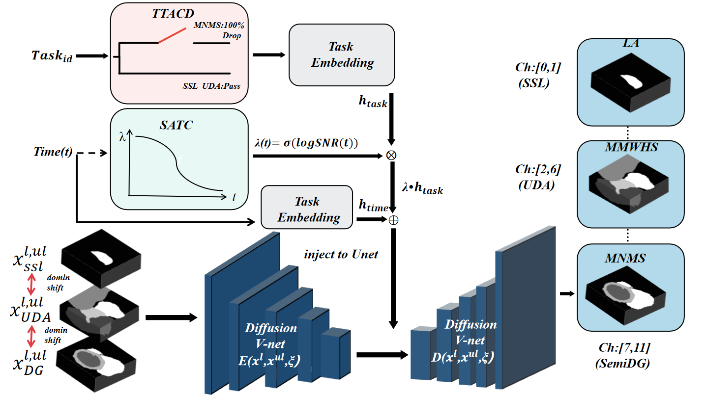

# [IEEE SMC 2026] SNR-Adaptive Unified Diffusion for Multi-Task Medical Image Segmentation (UniT-Diff)

This repository is the official PyTorch implementation of **SNR-Adaptive Unified Diffusion for Multi-Task Medical Image Segmentation**, accepted as a Regular Paper at the 2026 IEEE International Conference on Systems, Man, and Cybernetics (SMC).

**Authors:** Jiahao Liu, Hang Wei, Shuai Wu*

[](https://opensource.org/licenses/MIT)
[](https://pytorch.org/)

## 🚀 Overview

Developing a unified foundation model for multi-task medical image segmentation faces severe challenges such as **semantic collision** (e.g., the left ventricle is background in one dataset but foreground in another) and **domain shift** across different modalities and centers. 

To address these challenges, we propose **UniT-Diff**, an SNR-Adaptive Unified Diffusion Framework featuring:
- **11-Channel Decoupled Output Space:** Physically isolating the output space to eliminate cross-task softmax competition.
- **Task-Type-Aware Conditioned Dropout (TTACD):** A novel task-guided conditioning mechanism in the diffusion latent space to disentangle task-specific features without negative transfer.
- **SNR-Adaptive Time Conditioning (SATC):** Adapting the diffusion timestep embeddings based on the Signal-to-Noise Ratio to stabilize multi-dataloader joint training.

<p align="center">    

</p>

---

## 🛠️ 1. Environment Setup

Create a new conda environment and install the required dependencies:

```shell
conda create -n unitdiff python=3.9
conda activate unitdiff

# Clone the repository
git clone [https://github.com/your-username/SMC2026-UniT-Diff.git](https://github.com/your-username/SMC2026-UniT-Diff.git)
cd SMC2026-UniT-Diff

# Install dependencies
pip install -r requirements.txt

```

**[📌 IMPORTANT]** Before running the code, set the `PYTHONPATH` to your current working directory:

```shell
export PYTHONPATH=$(pwd)/code:$PYTHONPATH

```

---

## 💾 2. Data Preparation

Our unified framework jointly trains on three highly heterogeneous datasets. Please download and put them under the `Datasets` folder.

* **LASeg Dataset (Single-modality MRI):** Download the preprocessed data from [UA-MT](https://github.com/yulequan/UA-MT/tree/master/data).
* **MMWHS Dataset (Cross-modality CT/MRI):** Download according to [SIFA](https://github.com/cchen-cc/SIFA#readme). Or download our preprocessed data via [this link](https://www.google.com/search?q=%23). - **M&Ms Dataset (Multi-center Domain Generalization):** Download from [MNMs Challenge](https://www.ub.edu/mnms/).

The final file structure should look like this:

```text
.
├── code
│   ├── DiffVNet
│   ├── train_satc_ttacd.py
│   ├── eval_Taskcond.sh
│   └── ...
├── Datasets
├── LA_data
├── MMWHS_data
└── MNMS_data

```

---

## 🏃‍♂️ 3. Training (Unified Multi-Dataloader)

To train the UniT-Diff model jointly on all three datasets using the SATC and TTACD modules, run the following command:

```shell
python code/train_satc_ttacd.py \
    --exp satc_ttacd_la02 \
    --gpu 0 \
    --base_lr 0.01 \
    --max_epoch 300 \
    --norm instancenorm

```

**Key Parameters in `train_satc_ttacd.py`:**

* `TASK_DROPOUT_RATE`: Controls the probability of injecting the task token for LA, MMWHS, and MNMs (TTACD module).
* `GLOBAL_CLASSES = 11`: The decoupled 11-channel output space.

---

## 📊 4. Testing & Evaluation

We provide an automated shell script to test the unified model and evaluate the Dice and ASD scores across all three tasks sequentially.

```shell
# Run the automated evaluation script
bash code/eval_Taskcond.sh

```

Make sure the `EXP_NAME` inside `eval_Taskcond.sh` matches your training experiment name (e.g., `satc_ttacd_la02_instancenorm`). The results will be automatically saved and summarized in `logs/<EXP_NAME>/eval_results/TaskCond_Final_Scores.txt`.

---

## 🏆 5. Results

Our UniT-Diff framework achieves state-of-the-art unified performance, successfully overcoming the negative transfer often seen in naive joint training.

| Task | Modality / Target | Target Split | Avg Dice (%) |
| --- | --- | --- | --- |
| **LA** | Atrium MRI | `test` | **91.11** |
| **MMWHS** | MR $\rightarrow$ CT | `test_ct` | **90.85** |
| **MNMs** | Multi-Center $\rightarrow$ B | `test_toB_0.05` | **85.82** |

---

## 📖 Citation

If you find this code or our concepts helpful for your research, please cite our SMC 2026 paper:

```bibtex
@inproceedings{liu2026snradaptive,
  title={SNR-Adaptive Unified Diffusion for Multi-Task Medical Image Segmentation},
  author={Liu, Jiahao and Wei, Hang and Wu, Shuai},
  booktitle={2026 IEEE International Conference on Systems, Man, and Cybernetics (SMC)},
  year={2026},
  organization={IEEE}
}

```

## 🙏 Acknowledgments

This codebase is built upon the foundational work of [GenericSSL](https://www.google.com/search?q=https://github.com/HaonanWang/GenericSSL) (NeurIPS 2023). We sincerely thank the authors for open-sourcing their diffusion framework.


>>>>>>> 
